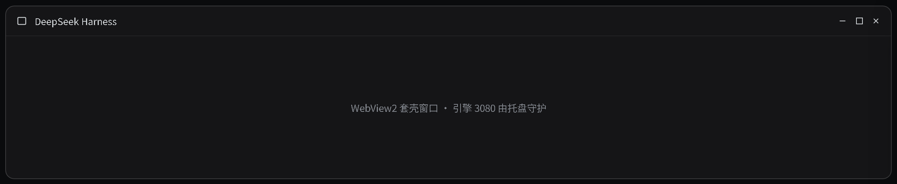
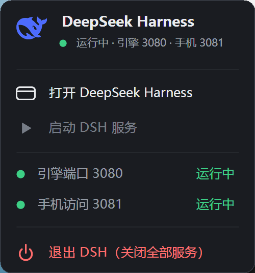

# dsh-desktop

> 本仓**只有 vk 版**：位置 —— 不是插件：Windows 桌面外壳（WebView2）+ 系统托盘守护，需先装 [dsh-vk-suite](https://github.com/Ln1m/dsh-vk-suite) 契约 + 骨架。
> 冲突：一个槽位只渲染优先级最高的一条，同优先级重复注册会直接抛错；与占同一位置的插件互斥（详见 [dsh-vk-suite](https://github.com/Ln1m/dsh-vk-suite) 的「推荐怎么用 / 会跟谁冲突」）。

[English](README.en.md) · 中文




*界面实拍：截自本机运行中的 DSH 实例。*

DeepSeek Harness 的 Windows 桌面套壳和系统托盘守护，两个 C# 单文件程序，源码级开源。

| 程序 | 作用 |
|---|---|
| `apps/dsh-desktop/App.cs` | WebView2 窗口套壳：把 DSH 的 web UI 装进原生窗口，拉引擎、解析启动 token、内化充值/用量/API Key 页面、关窗确认 |
| `dsh-tray/dsh-tray.cs` | 系统托盘守护：自绘深色菜单、状态灯、启停 3080 引擎与 3081 手机反代，唯一退出入口「退出 DSH」 |

启动片头：[`dsh-boot-splash`](https://github.com/Ln1m/dsh-host-splash) —— 窗口刚起、页面还没渲染时铺满播放的开机动画层（毛玻璃「跳过」气泡 + 片库配置）。

## 目录约定

两个程序按 DSH 安装根拼路径，默认 `%USERPROFILE%\DeepSeek_harness`，可用环境变量覆盖：

| 变量 | 默认 | 说明 |
|---|---|---|
| `DSH_ROOT` | `%USERPROFILE%\DeepSeek_harness` | 安装根；`node_modules\.bin\dsh.cmd`、`dsh-tray\`、`apps\dsh-desktop\`、`logs\`、`assets\` 都由它派生 |
| `DSH_NODE` | `%ProgramFiles%\nodejs\node.exe` | 托盘拉起引擎用的 node |
| `DSH_TRAY_EXE` | `<DSH_ROOT>\dsh-tray\DSH-Tray.exe` | 桌面端确保托盘在跑时用的路径 |
| `DSH_ICON` | 无 | 桌面端窗口图标（不给就不设图标） |

仓库布局就是安装根布局：把 `apps/` 和 `dsh-tray/` 放进你的 DSH 安装根即可。

## 编译

需要 .NET Framework 自带的 csc（`%WINDIR%\Microsoft.NET\Framework64\v4.0.30319\csc.exe`）与 WebView2 运行时。

```powershell
# 桌面端（默认产出 dsh-desktop-new.exe，配合 apply-new.ps1 热替换）
powershell -File .\apps\dsh-desktop\build.ps1

# 托盘（产出 dsh-tray\build\DSH-Tray.exe）
powershell -File .\dsh-tray\build.ps1
```

`apps/dsh-desktop/` 里已带三个 WebView2 SDK DLL（微软可再发行件）：`Microsoft.Web.WebView2.Core.dll`、`Microsoft.Web.WebView2.WinForms.dll`、`WebView2Loader.dll`。

## 图标与品牌图

窗口图标由构建时的 `DSH_ICON` 指定；仓库 `assets/` 下带了一个自制的默认图标 `deepseek_harness.ico`（蓝底「DS」，非官方品牌图），不指定就不设图标。托盘品牌图从 `<DSH_ROOT>\assets\` 取，取不到就退化绘制。

## 前提

- Windows，.NET Framework 4.x
- 已装 WebView2 运行时
- `dsh` 装在 `<DSH_ROOT>`（`node_modules\.bin\dsh.cmd` 存在）
