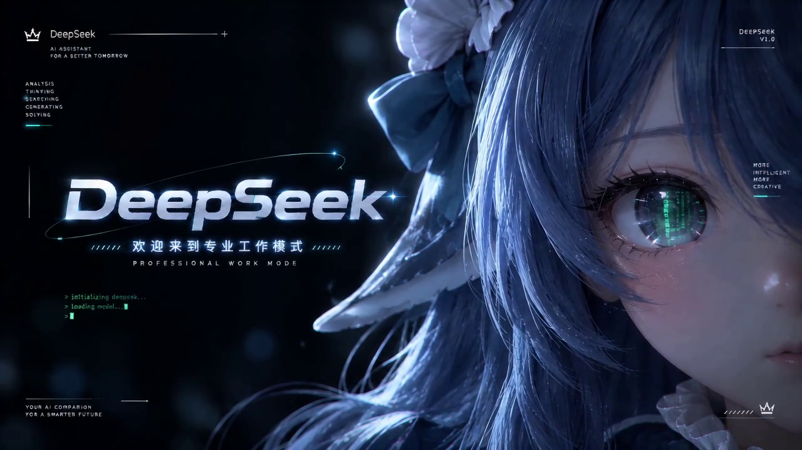

# dsh-boot-splash

> **The vk build only**: position — not a plugin: the boot splash layer that covers the page before it renders; install the [dsh-vk-suite](https://github.com/Ln1m/dsh-vk-suite) contract + skeleton first.
> Conflicts: a slot renders only its highest-priority entry, and two registrations at the same priority throw; mutually exclusive with anything claiming the same position (see "How to use it / what it conflicts with" in [dsh-vk-suite](https://github.com/Ln1m/dsh-vk-suite)).

English · [中文](README.md)




*Frames taken at 3 s and 5 s of `media/cyberpunk-intro.mp4`.*

A **boot splash layer** for WinForms + WebView2 apps: as soon as the window appears it plays a full-frame intro, covering the gap while WebView2 initializes and the page has not painted yet. The moment the page is ready, a frosted-glass **Skip** pill fades in at the top right; the layer leaves when the current pass ends or the user clicks it.

- Play, pause a few seconds, start over (3 s by default, configurable)
- Loops while the page is not ready, so there is never a black screen
- Once the page is ready it still finishes the current pass — click **Skip** if you do not want to wait
- Swap the clip without touching code: drop an mp4 into `videos\`, edit one line of `config.json`

## Animation credit

`media/cyberpunk-intro.mp4` comes from **[NativeDog1/dsh-boot-animation](https://github.com/NativeDog1/dsh-boot-animation)**, where it is stored as `media/deepseek-cyberpunk-intro.mp4` (1280×720 / 24 fps / 7.05 s / H.264 + AAC).

Upstream distributes code and media under **BSD-3-Clause**; the license text is kept at
[`licenses/dsh-boot-animation-BSD-3-Clause.txt`](licenses/dsh-boot-animation-BSD-3-Clause.txt).
**Copyright of the animation belongs to its original author.** This repository only re-hosts it together with playback code; the code here is [MIT](LICENSE).

DeepSeek names and logos belong to Hangzhou DeepSeek Artificial Intelligence Basic Technology Research Co., Ltd. This project is not affiliated with it.

## Layout

Runtime directory defaults to `%USERPROFILE%\.dsh\boot-splash\`:

| Path | Purpose |
|---|---|
| `index.html` | Playback page: reads config, plays, re-plays with a gap, shows the skip pill |
| `config.json` | `{ "video": "cyberpunk-intro.mp4", "gapMs": 3000 }` |
| `videos\*.mp4` | Clip library; drop an mp4 in and pick it |

If `config.json` cannot be read, or its `video` file is missing, the page falls back to `videos/cyberpunk-intro.mp4`. UTF-8 with or without BOM is fine.

## Embedding

```csharp
// Once: lay the page and the default clip into the runtime directory
BootSplashOverlay.Ensure(@"C:\Users\you\.dsh\boot-splash", @"<repo>\src\splash");

BootSplashOverlay splash = new BootSplashOverlay(@"C:\Users\you\.dsh\boot-splash", null);
splash.Attach(this);                 // your Form; the layer goes on top

await web.EnsureCoreWebView2Async(mainEnv);
await splash.StartAsync(mainEnv);    // share one Environment with the main view

// when the main view's NavigationCompleted reports success:
splash.ReleaseToUser();

// when you need to retry or show your own message:
splash.Hide();
```

`src/BootSplashOverlay.cs` is the reusable form of this logic; the equivalent implementation inside the DSH desktop shell ([Ln1m/dsh-host-desktop](https://github.com/Ln1m/dsh-host-desktop)) is inlined in its `App.cs`.

## Behaviour

- The clip ends → pause `gapMs` (default 3000) → restart from the beginning, looping
- The page receives `__splashReady()`: it sets `hold` and shows **Skip**; if it happens to be in the gap, it reports finished immediately
- When the pass ends with `hold` set, or the user clicks Skip, the page posts `chrome.webview.postMessage` with `splash-ended` / `splash-skip`; the host hides the layer on receipt
- Hiding the layer is just `Visible = false`; it does not disturb the host's own control order

## Build

Needs the csc shipped with .NET Framework and the WebView2 runtime:

```powershell
csc /nologo /target:winexe /out:demo.exe `
  /r:System.dll /r:System.Core.dll /r:System.Windows.Forms.dll /r:System.Drawing.dll `
  /r:Microsoft.Web.WebView2.Core.dll /r:Microsoft.Web.WebView2.WinForms.dll `
  src\BootSplashOverlay.cs your-program.cs
```

The three WebView2 SDK DLLs come from the `Microsoft.Web.WebView2` NuGet package, or from any WebView2-based app already on your machine.

## License

- Code in this repository: [MIT](LICENSE)
- `media/cyberpunk-intro.mp4`: see "Animation credit" above — BSD-3-Clause, copyright of the original author
